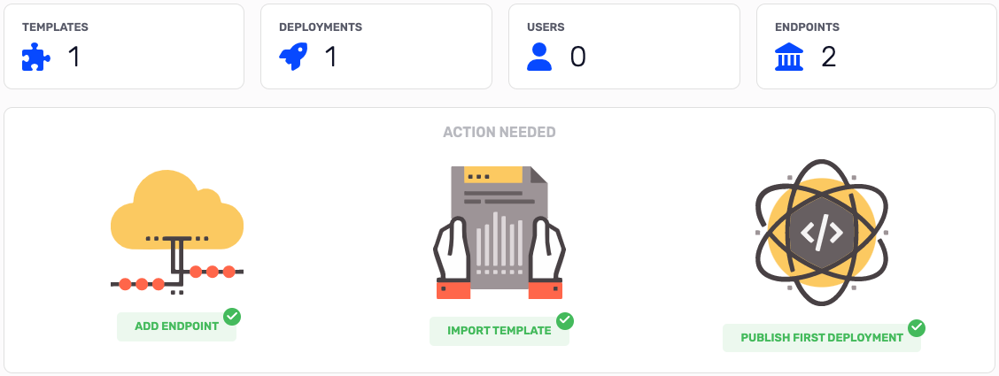

# Dashboard

In the dashboard page, you have a summary of your apps and their status.

## Top bar

- [templates](./app-templates.md): is the total number of templates you have imported.
- [deployments](./app-deployments.md): is the total number of deployments.
- users: (not yet implemented) is the total number of users.
- [endpoints](./app-endpoints.md): is the total number of endpoints.

# Action needed

There are three steps to complete the tutorial:

- add endpoint
- import template
- create deployment

every successive step is blocked until the previous step is completed.
