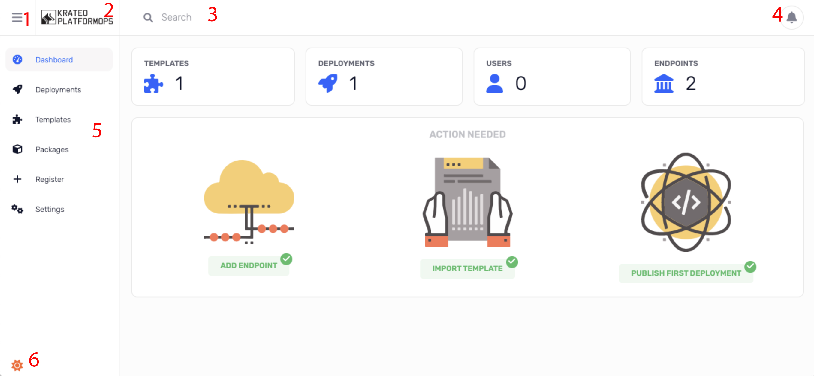

# App

App is the frontend of the application. It is a single page application that uses [React](https://reactjs.org/) and [Redux](https://redux.js.org/).

## Structure

.

1. Hamburger menu: you can collapse or expand the menu.
2. Logo: if you go hover with the mouse, you can see the version of the application.
3. search bar: search for resources in all the application.
4. notifications bell: if you click on it you can show/hide the notification bar.
5. navigation menu: you can navigate through the application.
6. theme icon: you can change the theme of the application (dark or light).

### Navigation menu

- [Dashboard](./app-dashboard.md): it shows the main information of the application. In the top you have a summary of number of templates, deployments, users and endpoints. In the bottom you have a wizard to create a new deployment.
- [Deployments](./app-deployments.md): it shows the list of deployments. You can create a new deployment, view or delete an existing one.
- [Templates](./app-templates.md): it shows the list of templates. You can view and use or delete an existing one.
- [Packages](./app-packages.md): it shows the list of packages. You can add, view, update or delete an existing one.
- [Register](./app-register.md): here you can add a template.
- [Settings](./app-settings.md): in this section you can view your login information, endpoints, secrets, components and you can logout from krateo.
