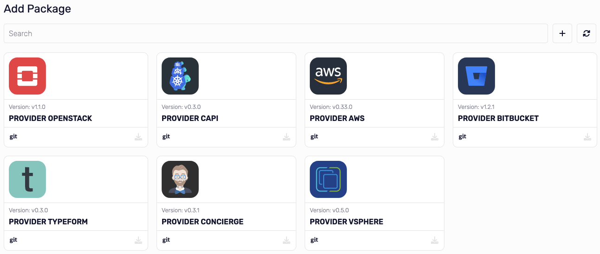

# Packages


Krateo works with packages (providers).
In this section you can see all the packages that are available in the system and the status.
If a package is outdated, you can update it by clicking on the button on the bottom right.

In the above example you can see that "provider-helm" is not ready yet.

## Add package



Clicking on the plus button on the top right, you can add a new package.

You have a list of available packages, certified by krateo, that you can add to the system.

If you want to add custom package, you can click again to the plus button on the top right and paste yaml of your package.

This is an example of a custom package (in this case a provider for vsphere):

```yaml
apiVersion: meta.pkg.crossplane.io/v1
kind: Provider
metadata:
  name: provider-vsphere
  annotations:
    meta.crossplane.io/maintainer: Krateo PlatformOps Maintainers <info@krateo.io>
    meta.crossplane.io/source: github.com/krateoplatformops/provider-vsphere
    meta.crossplane.io/license: Apache-2.0
    meta.crossplane.io/description: |
      A Crossplane Provider for VSphere.
spec:
  controller:
    image: ghcr.io/krateoplatformops/provider-vsphere-controller:v0.5.0
```
