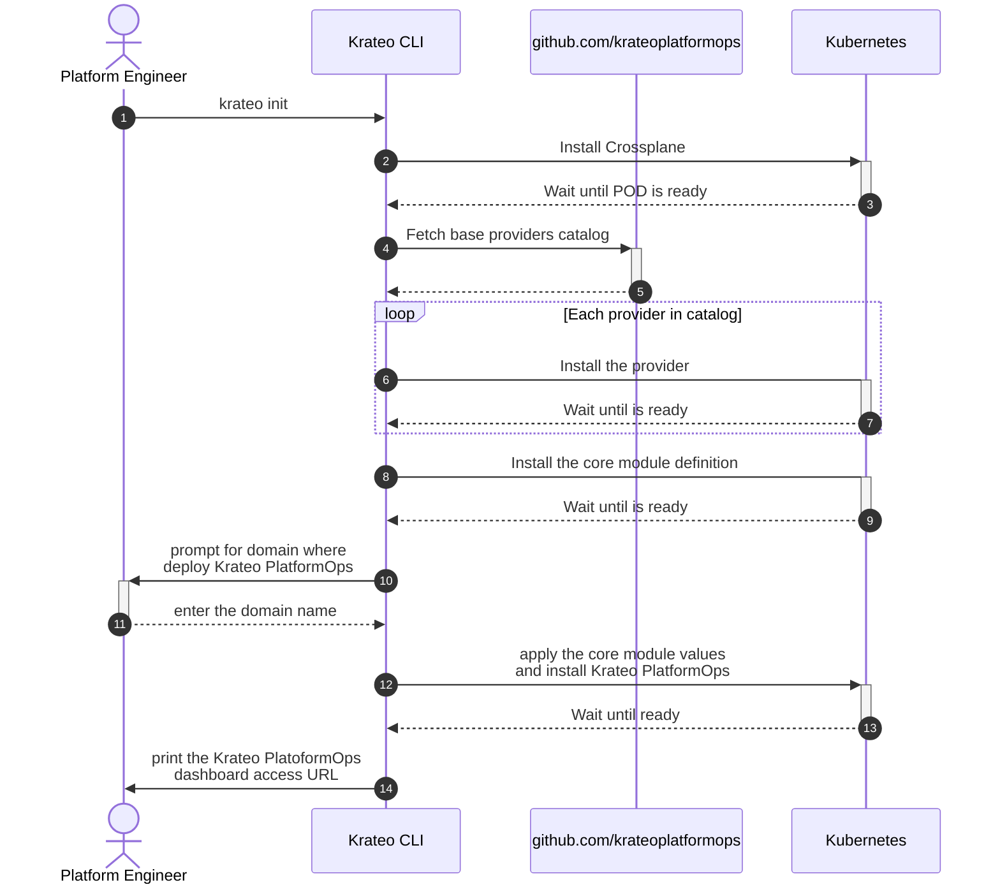

```mermaid
sequenceDiagram
    actor U as Platform Engineer
    participant A as Krateo CLI
    participant B as github.com/krateoplatformops
    participant C as Kubernetes
    
    autonumber

    U ->>A: krateo init

    A->>+C: Install Crossplane
    C-->>-A: Wait until POD is ready
    
    A->>+B: Fetch base providers catalog
    B-->>-A: #160;
    loop Each provider in catalog
        A->+C: Install the provider
        C-->>-A: Wait until is ready
    end

    A->+C: Install the core module definition
    C-->>-A: Wait until is ready 

    A->>+U: prompt for domain where<br>deploy Krateo PlatformOps
    U-->>-A: enter the domain name

    A->>+C: apply the core module values<br>and install Krateo PlatformOps
    C-->>-A: Wait until ready

    A->>U: print the Krateo PlatoformOps<br> dashboard access URL     
```
