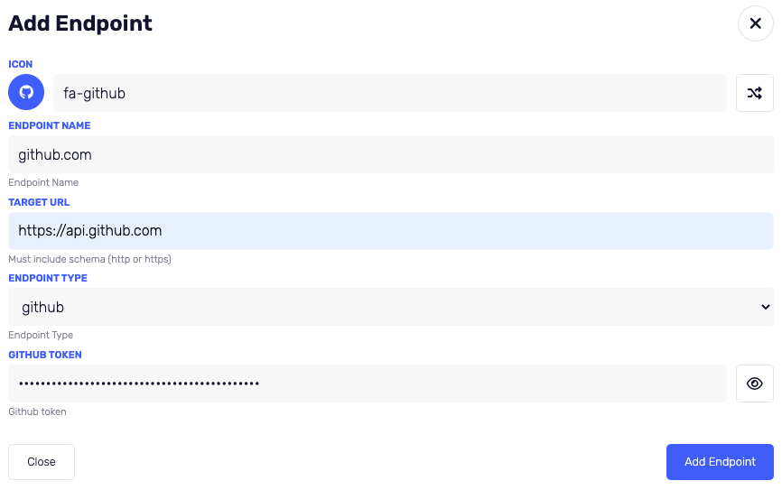

# Add Endpoint

## GitHub Token

1. Go to [GitHub Developer Settings](https://github.com/settings/apps)
2. On the left menu click on `Personal access tokens`
3. On the top right click on `Generate new token` (classic token should be fine)
4. Here you can give the token a name and select the scopes you want to give it
   
   Customize the expiration date to your needs.
   Grant repo permissions to the token.
5. Copy the token and save it somewhere safe

## Add the token to Krateo

1. Login to Krateo
2. Click on the left menu to `Settings`
3. On the menu in the right pane click on `Endpoints`
4. Click on the `plus button` to add a new endpoint (top right)
5. Fill the form as this example
   
   - `icon` is the icon you want to use for the endpoint
   - `Name` is the name of the endpoint
   - `Target` is the URL of the endpoint (if you use github.com you can use `https://api.github.com`)
   - `endpoint type` is _github_
   - `github token` is the token you created in the previous step
6. If you have filled all the fields correctly you should see that the `Add Endpoint` button is now enabled
7. Click on the `Add Endpoint` button to add the endpoint to Krateo
8. Well done! You have added your first endpoint to Krateo
