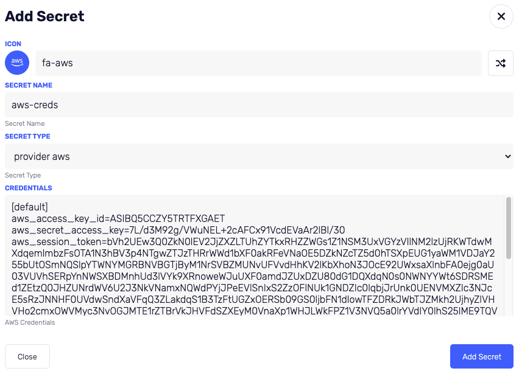
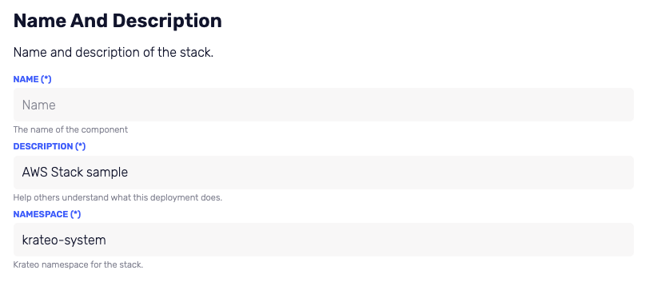
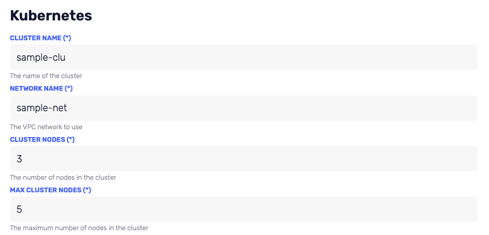
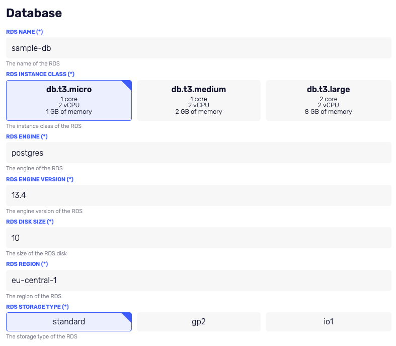

# Create AWS Stack: EKS + RDS

Now you are ready to install something more interesting: a full stack on AWS! A kubernetes cluster (EKS) and a postgres db (RDS).

## Get Credentials

First you need to get your AWS credentials. You can do this by following the [AWS documentation](https://docs.aws.amazon.com/cli/latest/userguide/cli-configure-files.html).

Credentials look like this:

```yaml
[default]
aws_access_key_id=ASIBQ5CCZY5TRTFXGAET
aws_secret_access_key=7L/d3M92g/VWuNEL+2cAFCx91VcdEVaAr2lBl/30
aws_session_token=bVh2UEw3Q0ZkN0lEV2JjZXZLTUhZYTkxRHZZWGs1Z1NSM3UxVGYzVllNM2lzUjRKWTdwMXdqemlmbzFsOTA1N3hBV3p4NTgwZTJzTHRrWWd1bXF0akRFeVNaOE5DZkNZcTZ5d0hTSXpEUG1yaWM1VDJaY255bUtOSmNQSlpYTWNYMGRBNVBGTjByM1NrSVBZMUNvUFVvdHhKV2lKbXhoN3JOcE92UWxsaXlnbFA0ejg0aU03VUVhSERpYnNWSXBDMnhUd3lVYk9XRnoweWJuUXF0amdJZUxDZU80dG1DQXdqN0s0NWNYYWt6SDRSMEd1ZEtzQ0JHZUNrdWV6U2J3NkVNamxNQWdPYjJPeEVlSnIxS2ZzOFlNUk1GNDZIc0lqbjJrUnk0UENVMXZIc3NJcE5sRzJNNHF0UVdwSndXaVFqQ3ZLakdqS1B3TzFtUGZxOERSb09GS0ljbFN1dlowTFZDRkJWbTJZMkh2UjhyZlVHVHo2cmxOWVMyc3NvOGJMTE1rZTBrVkJHVFdSZXEyM0VnaXp1WHJLWkFPZ1V3NVQ5a0lrYVdIY0lhS25lME9TQVNuUHBpUGQwWkNiejVHRkk3dkNJaXRucG5aNnBWeVlnRG0xTW5aTlBzTElVM0pnUldxM0FHaExXQXV0Sm5pUXlSZFlaeDlWRGp5SGxTdFBmSlJMcElHajF6elV2ZGdwTU03UlQwN3JyVzVndHpmQ05WNjlJelNsVEFFZXBnQVIwMTk0ZjVrbE1MdGxidEZLcGFJSERDd0ROYk1EWjNFMGFCUkNGU2wyMWZBeDNickI0bG05a1dKc0swNk9XN1RvMFN4WjQ0THBvd2N2cExkNnhRbFo1b2tVMzNjeUZUeFJoWmpkQzUzMGlMR1pSMGIzNVlYbHpwektoVlVtakRPNW1PbG8zU2o0T1VpaVdCaHNNOGxPblhTY0NGZEEzNFlhOEhrbE5DTGJqU29RZE5HTzFQSUVUQnJyVmwzMGFBYVB1VjJDVWZNMUZoWGFUbjd5ZWttYWtHM3E2Z1J2WmF4RjVFT2NTbGozVWNmNjZxZ3k5bEJNSkVwbWhFeGkwMnVwa0g2TXFoMXAzTXc1OFp2ZlRMOUNibFl3UTRLSjNPUE1iTElIakFqVFYxd1U5V09OYkZqUTlaZ0pRTzJ1OGkxbU5sRHlHaDVUYjFyQ2xUbUZsNGZUWU1BQ09GU0JmRVhQVTN5UUkwCg==
```

## Add Credentials to Krateo

Now you need to add your credentials to krateo. Here the required steps:

1. Login to Krateo
2. Go to the `settings` page
3. On the right menu click on "secrets"
4. Click on the plus button on the top right
5. Fill the form with the following values:

```yaml
name: aws-creds
secret type: provider aws
credentials: <your credentials from previous step>
```



## Import the template

Now you can import the template.
The AWS stack template is available here

````url
https://github.com/krateoplatformops/krateo-template-awsstack/blob/main/template.yaml```
````

1. Login to Krateo
2. Go to `register` page
3. Add the url of the template in the form (here you must have already created the GitHub endpoint, if not, follow this [tutorial](./add-endpoint.md))
4. Click on `register` button

## Install the Required Provider

To deploy the stack you need to install some provider. You can do this by doing this:

1. Login to Krateo
2. Go to `packages` page
3. Click on the `plus` button on the top right

   

4. The required providers are:

   - `provider-aws`
   - `provider-git`
   - `provider-github`

5. Simply click on the `bottom right` button for each provider to install them

## Create the stack (use the template)

The AWS Stack template has 4 steps

1. Name and description: you can add the name of the deployment and a description
   
2. Kubernetes: set the name for the cluster and for the network. Be careful, AWS charges you for the resources you create, so you shouldn't set too many nodes.
   
3. Database: set the name of the database and other settings.
   
4. Git repository destination: set the name of the target repository and please set the corret organization name.
   

After you have filled the form, click on `deploy` button.

## Check the deployment

After some seconds, on your AWS console you should see the new resources are in creating status.


After a few minutes, the resources should be ready.

!!! Note

    Please note, if you delete the stack, the resources will be deleted too.

    If the resources will not be created after a few minutes, please check the logs of the deployment and your AWS credentials.
