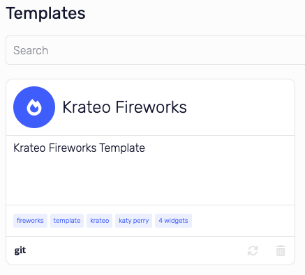

# Import Template

## Template Repository

You can create your own or you can use the [krateo template fireworks app](https://github.com/krateoplatformops/krateo-template-fireworksapp) provided by Krateo.

Let's assume you will use the krateo fireworksapp template

1. Go to this repository [krateo template fireworks app](https://github.com/krateoplatformops/krateo-template-fireworksapp)
2. In the root of the root of the repository click on the `template.yaml` file
3. Copy the url of this file.
4. Should be something like this: `https://github.com/krateoplatformops/krateo-template-fireworksapp/blob/main/template.yaml`

## Import Template

1. Login to Krateo
2. Click on the left menu to `Register`
3. If you have successfully completed the previous step you should see the endpoint field filled in with the name of the endpoint you have created.
4. Paste the full url of the `template.yaml` file in the `Full Url` field.
   
5. Now the `Import` button is enabled and you can import the template
6. After the import you will be redirect to the templates page
7. Great! You have successfully imported the template
   
